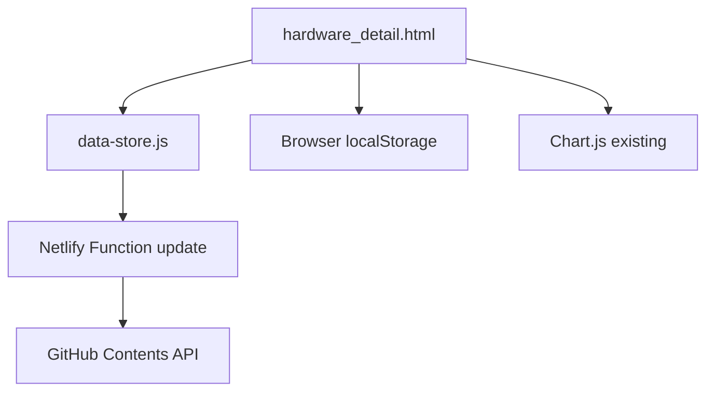
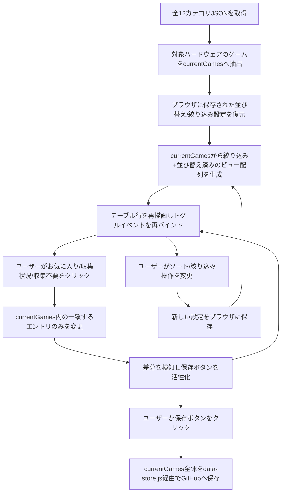

# Design Document

## Overview
**Purpose**: 本機能は、ハードウェア詳細ページ(`hardware_detail.html`)の利用者に、お気に入り登録・並び替え・絞り込みという3つの閲覧・管理手段を提供する。
**Users**: コレクション管理者(サイト運営者本人)が、数百件規模のハードウェアのゲーム一覧から目的のゲームを見つけ、優先的に追いたいゲームを管理するために利用する。
**Impact**: `hardware_detail.html`のインライン実装を拡張し、データ取得・GitHub保存・エスケープ処理を新規共有モジュール`scripts/data-store.js`に切り出す。既存の収集状況・収集不要・クリア済みの表示・編集・保存動作、およびページ上部の収集率グラフの集計範囲は変更しない。

### Goals
- ゲームごとのお気に入り登録・表示・既存保存フローでの永続化
- タイトル/発売日/ジャンル/収集状況/お気に入りによる並び替え(昇順・降順)
- 収集済み/未収集・クリア済み/未クリア・収集不要・お気に入りのみによる複合絞り込み
- ソート・絞り込みの選択状態をブラウザ単位で記憶し、次回表示時に復元する
- 既存の収集状況編集・保存・グラフ集計の挙動を一切変更しない

### Non-Goals
- `index.html`への機能追加
- 全ハードウェアを横断した重複ゲームの検出・削除(`duplicate-game-cleanup` spec)
- 「プレイ済み」専用の新規データフィールド追加(既存の`collected_new`/`collected_old`を流用)
- 認証・アクセス制御の追加
- `views/*.ejs`・`public/styles.css`・`scripts/app.js`(未使用の旧実装)の復旧・修正

## Boundary Commitments

### This Spec Owns
- `favorite`フィールドの表示・編集・既存保存フローへの統合
- `hardware_detail.html`のソート・絞り込みUIと、クライアント側の並び替え/絞り込みロジック
- ソート・絞り込み選択状態のブラウザ内(localStorage)保存・復元ロジック
- `scripts/data-store.js`の初版インターフェース(データ取得・GitHub保存・HTMLエスケープの共有ロジック)。このインターフェースは`duplicate-game-cleanup` specからも利用される前提で設計する

### Out of Boundary
- 全ハードウェア横断の重複検出・削除UI/ロジック(`duplicate-game-cleanup` spec)
- `index.html`のUI変更
- 「プレイ済み」専用の新規データフィールド
- `netlify/functions/update.js`自体の変更(既存のまま利用する)
- `views/*.ejs`・`public/styles.css`・`scripts/app.js`(いずれのHTMLからも参照されていない未使用の旧実装)

### Allowed Dependencies
- `netlify/functions/update.js`(既存、変更しない)— GitHub Contents API経由の保存を担う
- `data/*.json`の既存スキーマ(`soft_title`, `collected_new`, `collected_old`, `game_cleared`, `dont_collect`, `game_category`, `release_day`)
- ブラウザの`localStorage`(本specで新規キーを追加、既存キーの流用はしない)
- Chart.js(既存、収集率グラフ描画。変更なし)

### Revalidation Triggers
- `scripts/data-store.js`の関数シグネチャ(`fetchAllCategoryData` / `saveToGitHub` / `escapeHtml`)を変更する場合、`duplicate-game-cleanup` spec側の実装が影響を受けるため要再確認
- `data/*.json`のゲームオブジェクトスキーマにフィールドを追加・変更する場合、両spec双方の保存ロジックに影響するため要再確認
- `netlify/functions/update.js`のリクエスト/レスポンス契約を変更する場合、両spec双方の保存呼び出しに影響するため要再確認

## Architecture

### Existing Architecture Analysis
- `hardware_detail.html`は完全にインラインのHTML/CSS/JSで構成され、外部の`public/styles.css`・`scripts/app.js`は参照していない
- データ読み込みは`fetch`で`data/*.json`(全12ファイル)を並列取得し、`extractHardwareData`でURLパラメータのハードウェア名に一致するゲーム配列を抜き出す
- 編集はクリックによるトグルで`currentGames`配列内のエントリを直接変更し、`markChanged`が変更差分を検知して保存ボタンの有効/無効を切り替える
- 保存は`saveToGitHub`が`currentGames`全体をJSON文字列化し、Netlify Function(`netlify/functions/update.js`)経由でGitHub Contents APIにPUTする。Functionはpath/content/messageのみを受け取る汎用実装で、スキーマに依存しない

### Architecture Pattern & Boundary Map



**Architecture Integration**:
- Selected pattern: 静的ページ内のクライアントサイド・オーケストレーション(フレームワーク・ビルドツールなし)を継続
- Domain/feature boundaries: 表示・編集・状態管理は`hardware_detail.html`内のページコンポーネントが担い、データ取得・保存・エスケープは`data-store.js`に分離。ブラウザ内の設定記憶は独立した小さな責務として分離
- Existing patterns preserved: クリックトグル→`markChanged`→保存ボタン活性化→`saveToGitHub`という既存の編集・保存フローはそのまま維持し、対象フィールドに`favorite`を追加するだけとする
- New components rationale: `data-store.js`は本specと`duplicate-game-cleanup` specの両方が同じデータ取得・保存ロジックを必要とするために新設。ブラウザ内の設定記憶ロジックはページ本体から分離することで責務を明確にする
- Steering compliance: ビルドステップを追加しない、GitHub Pages+Netlify Functionsの既存構成を継続する制約(discoveryのroadmap.mdで確定済み)を満たす

### Technology Stack

| Layer | Choice / Version | Role in Feature | Notes |
|-------|------------------|-----------------|-------|
| Frontend | Vanilla JavaScript (ES2017+, ブラウザネイティブ) | ソート・絞り込み・お気に入りUIの実装 | 既存コードと同じ記法を継続、新規ライブラリは追加しない |
| Client Storage | Web Storage API (`localStorage`) | ソート・絞り込み設定の永続化 | ブラウザネイティブ機能、追加の依存なし |
| Backend連携 | Netlify Functions(既存`update.js`) | GitHub Contents APIへの保存を代行 | 変更なし |
| データ | 静的JSONファイル(`data/*.json`、Git管理) | ゲームデータの格納 | `favorite`フィールドを追加(既存フィールドは変更なし) |

## File Structure Plan

### Directory Structure
```
scripts/
└── data-store.js         # 新規: 全カテゴリJSON取得・GitHub保存・HTMLエスケープの共有ロジック
```

### Modified Files
- `hardware_detail.html` — 以下を追加・変更する
  - `<script src="scripts/data-store.js">`の読み込み追加、既存インラインの`jsonFiles`配列・`saveToGitHub`関数・`escapeHtml`関数を削除し`data-store.js`呼び出しに置き換え
  - お気に入り列の追加(表示・クリックトグル)とゲームオブジェクトへの`favorite`フィールドの反映
  - ソート操作UI(項目選択+昇降順トグル)と、選択に基づく並び替えロジックの追加
  - 絞り込み操作UI(収集状況/クリア状況のセレクト、収集不要/お気に入りのチェックボックス)と、複合条件によるビュー生成ロジックの追加
  - ソート・絞り込み設定をブラウザに保存・復元する小さなヘルパー(`PreferenceStore`相当)の追加
  - 絞り込み結果が0件の場合の空状態メッセージ表示の追加

### Unchanged (参考として明示)
- `netlify/functions/update.js` — 変更なし(汎用的なpath/content保存のため`favorite`追加の影響を受けない)
- `data/*.json` — 既存データの一括変更は不要(`favorite`未設定時はfalse扱い)
- `index.html`, `public/styles.css`, `scripts/app.js`, `views/*.ejs` — 変更なし(後者3つは既存の未使用ファイル)

## System Flows



**Key Decisions**:
- `currentGames`は絞り込み・並び替えの影響を受けない唯一の真実の源であり、ビュー配列は表示のためだけに毎回生成される
- 編集操作は常に`currentGames`側のエントリを変更するため、絞り込み中に編集してもデータの欠落は発生しない
- 保存は常に`currentGames`全体を対象とし、表示中のビュー(絞り込み後の部分集合)を保存対象にしない

## Requirements Traceability

| Requirement | Summary | Components | Interfaces | Flows |
|-------------|---------|------------|------------|-------|
| 1.1 | お気に入りの視覚的表示 | HardwareDetailPage | renderFavoriteCell | Render |
| 1.2 | クリックでお気に入り切替 | HardwareDetailPage | toggleFavorite | Edit→Mutate |
| 1.3 | 変更時に保存ボタン活性化 | HardwareDetailPage | markChanged(拡張) | Mutate→MarkChanged |
| 1.4 | 保存でGitHubへ反映 | HardwareDetailPage, DataStoreModule | saveToGitHub | Save→SaveAll |
| 1.5 | 未設定時はfalse扱い | GameRecord(データモデル) | favoriteフィールド既定値 | Load→Extract |
| 2.1 | 並び替えキー選択UI | HardwareDetailPage | renderSortControls | Render |
| 2.2 | 昇順・降順切替UI | HardwareDetailPage | renderSortControls | Render |
| 2.3 | 選択に基づく再表示 | HardwareDetailPage | applySort | View |
| 2.4 | 選択をブラウザに記憶 | PreferenceStore | savePreference | Change→Persist |
| 2.5 | 開いた時に復元/既定適用 | PreferenceStore | loadPreference | Restore |
| 3.1 | 絞り込み条件UI | HardwareDetailPage | renderFilterControls | Render |
| 3.2 | 複合条件(AND)で表示 | HardwareDetailPage | applyFilter | View |
| 3.3 | 条件解除で全件表示 | HardwareDetailPage | applyFilter | View |
| 3.4 | 0件時の空状態メッセージ | HardwareDetailPage | renderEmptyState | Render |
| 3.5 | 変更をブラウザに記憶 | PreferenceStore | savePreference | Change→Persist |
| 3.6 | 開いた時に復元/既定適用 | PreferenceStore | loadPreference | Restore |
| 3.7 | 絞り込み中も編集可能 | HardwareDetailPage | toggleFavorite/Collected/Ignore | Edit→Mutate |
| 3.8 | グラフは常にハード全体集計 | HardwareDetailPage | displayChart(既存、変更なし) | Load→Extract |
| 4.1 | 既存編集・保存動作の非破壊 | HardwareDetailPage, DataStoreModule | 既存関数の保持 | 全体 |
| 4.2 | プレイ済みは既存フィールド流用 | GameRecord(データモデル) | 新規フィールド無し | - |
| 4.3 | 1回の保存でまとめて反映 | HardwareDetailPage, DataStoreModule | saveToGitHub | Save→SaveAll |

## Components and Interfaces

| Component | Domain/Layer | Intent | Req Coverage | Key Dependencies (P0/P1) | Contracts |
|-----------|--------------|--------|---------------|---------------------------|-----------|
| HardwareDetailPage | UI(hardware_detail.html) | 表示・編集・ソート・絞り込みの統括 | 1.1-1.3, 2.1-2.3, 3.1-3.4, 3.7-3.8, 4.1-4.3 | DataStoreModule(P0), PreferenceStore(P1) | State |
| DataStoreModule | 共有ロジック(scripts/data-store.js) | データ取得・GitHub保存・エスケープの共有処理 | 1.4, 4.1, 4.3 | netlify/functions/update.js(P0) | Service |
| PreferenceStore | 共有ロジック(hardware_detail.html内の小ヘルパー) | ソート・絞り込み設定のブラウザ内永続化 | 2.4-2.5, 3.5-3.6 | ブラウザlocalStorage(P1) | State |

### UI Layer

#### HardwareDetailPage

| Field | Detail |
|-------|--------|
| Intent | ハードウェア詳細ページの表示・編集・保存を統括するクライアントサイドコンポーネント |
| Requirements | 1.1, 1.2, 1.3, 2.1, 2.2, 2.3, 3.1, 3.2, 3.3, 3.4, 3.7, 3.8, 4.1, 4.2, 4.3 |

**Responsibilities & Constraints**
- `currentGames`(このハードウェアの全ゲーム、絞り込みの影響を受けない完全な配列)を単一の真実の源として保持する
- 絞り込み・並び替えは表示用のビュー配列を都度生成するのみで、`currentGames`自体を変更しない
- お気に入り・収集状況・収集不要のトグル編集は、表示中のビューではなく`currentGames`内の該当エントリを直接変更する
- 保存操作は常に`currentGames`全体(絞り込み前の全ゲーム)をDataStoreModule経由でGitHubに送信する

**Dependencies**
- Outbound: DataStoreModule — データ取得・保存・エスケープ処理 (P0)
- Outbound: PreferenceStore — ソート・絞り込み設定の読み書き (P1)
- External: Chart.js — 収集率グラフ描画、既存のまま変更なし (P2)

**Contracts**: State [x]

##### State Management
- State model: `currentGames`(配列、真実の源)、`viewState`(sortKey, sortOrder, filterConditionsをメモリ上に保持)
- Persistence & consistency: `viewState`のうちsortKey/sortOrder/filterConditionsはPreferenceStore経由でブラウザに永続化する。`currentGames`はGitHub保存が確定するまでメモリ上のみで保持し、ページを離れると破棄される(既存動作を継続)
- Concurrency strategy: 単一ブラウザタブ内の同期的なイベント処理のみを想定。複数タブ間の同時編集は対象外(既存動作を継続)

**Implementation Notes**
- Integration: 既存の`markChanged`/`saveToGitHub`呼び出しをDataStoreModuleへの呼び出しに置き換える。表示テーブルの再構築は、絞り込み適用→並び替え適用→行レンダリング→イベント再バインドの順で行う
- Validation: 絞り込み結果が0件の場合は空状態メッセージを表示し、テーブル本体は空のままにする
- Risks: 同一`soft_title`が複数存在する場合、トグル編集は最初に一致したエントリのみを更新する既存の制限が残る(重複解消は`duplicate-game-cleanup` specで対応)

### Shared Logic Layer

#### DataStoreModule (scripts/data-store.js)

| Field | Detail |
|-------|--------|
| Intent | 全カテゴリJSONの取得・GitHubへの保存・HTMLエスケープを提供する共有ロジックモジュール。本specと`duplicate-game-cleanup` specの双方から利用される |
| Requirements | 1.4, 4.1, 4.3 |

**Responsibilities & Constraints**
- ブラウザの`fetch`で`data/*.json`(全12ファイル)を読み込み、呼び出し元に生データを返す。ハードウェア別の抽出はHardwareDetailPage側の責務とする
- `netlify/functions/update.js`への保存呼び出しをラップし、呼び出し元にはpath/content/messageのみを要求する
- `netlify/functions/update.js`自体には変更を加えない
- DOM操作を行わず、ページ固有の状態を保持しない(純粋な取得・保存ヘルパーとして留める)

**Dependencies**
- Outbound: `netlify/functions/update.js` — GitHub Contents APIへのコミット (P0)
- Inbound: HardwareDetailPage(本spec)、将来的に`duplicates.html`(`duplicate-game-cleanup` spec) (P1)

**Contracts**: Service [x]

##### Service Interface
```
DataStoreModule.fetchAllCategoryData(): Promise<CategoryData[]>
DataStoreModule.saveToGitHub(path: string, content: string, message: string): Promise<{ success: boolean, error?: string }>
DataStoreModule.escapeHtml(value: string): string
DataStoreModule.CATEGORY_JSON_FILES: string[]

// CategoryData = { category: string, hardware_name: { [hardwareName: string]: GameRecord[] } }
```
`CATEGORY_JSON_FILES`は`fetchAllCategoryData()`の返り値と同順の`data/*.json`パス一覧を公開する定数配列であり、`fetchAllCategoryData()`が返す`CategoryData[]`にはファイルパス情報が含まれないため、呼び出し元(HardwareDetailPage)が保存先パス(`sourceJsonFile`)を特定するために利用する。DOM操作やページ固有の状態を持たない静的な設定値であり、Invariantsに抵触しない(タスク1.2実装時に追加、レビュー承認済み)。
- Preconditions: `fetchAllCategoryData`は常に12ファイル全てを対象とする(呼び出し元でファイルを絞り込むオプションは持たない)。`saveToGitHub`は呼び出し元が対象ファイルパスと保存後の全内容(差分ではなく全内容)を渡すこと
- Postconditions: `saveToGitHub`が`success: true`を返した場合、対象ファイルはGitHub上に新しいコミットとして反映されている
- Invariants: モジュールはページ固有の状態(`currentGames`や表示状態)を保持しない

**Implementation Notes**
- Integration: `hardware_detail.html`の既存インライン実装(`jsonFiles`配列、`saveToGitHub`関数、`escapeHtml`関数)をこのモジュールに移動し、`<script src="scripts/data-store.js">`で読み込む
- Validation: 保存先ファイルパスが特定できない場合のエラー表示は、呼び出し元(HardwareDetailPage)側の既存チェックを保持する
- Risks: `fetchAllCategoryData`は常に全12ファイルを取得するため軽微な読み込みコストが発生するが、既存実装も元々12ファイル全取得だったため劣化ではない

#### PreferenceStore

| Field | Detail |
|-------|--------|
| Intent | ソート・絞り込みの選択状態をブラウザに保存し、次回表示時に復元する小さな永続化ヘルパー |
| Requirements | 2.4, 2.5, 3.5, 3.6 |

**Responsibilities & Constraints**
- 保存対象はソートキー・ソート順・絞り込み条件のみ(お気に入り状態やゲームデータそのものは保存しない)
- 設定は全ハードウェア共通の1組のみを保持する(ハードウェアごとの個別記憶は行わない、[[research.md]]の設計判断を参照)
- ブラウザのストレージ機能が利用できない場合(プライベートブラウジング等)は、記憶・復元を行わずデフォルト状態にフォールバックする

**Contracts**: State [x]

##### State Management
- State model: `{ sortKey, sortOrder, filters: { collectionStatus, clearStatus, dontCollectOnly, favoriteOnly } }`
- Persistence & consistency: ブラウザの`localStorage`に単一キーでJSONとして保存する。読み込み失敗・パース失敗時は既定値(発売日昇順、絞り込み無し)を返す
- Concurrency strategy: 対象外(単一ブラウザ内の同期読み書きのみ)

**Implementation Notes**
- Integration: HardwareDetailPageがページ読み込み時に読み込み関数を呼び、コントロール変更時に保存関数を呼ぶ
- Validation: 保存されている値が既知のソートキー/フィルタ種別に一致しない場合は既定値を採用する
- Risks: ストレージ無効環境でも例外を投げず既定動作にフォールバックすることを保証する(try/catchで保護する)

## Data Models

### Domain Model
既存の`data/*.json`内のゲームエントリ(GameRecord)に`favorite`フィールドを追加する。`soft_title`, `collected_new`, `collected_old`, `game_cleared`, `dont_collect`, `game_category`, `release_day`は変更しない。

### Logical Data Model

| Field | Type | Required | Default | Notes |
|-------|------|----------|---------|-------|
| favorite | boolean | No(省略可) | false | 省略時はお気に入りではないとみなす(1.5) |

既存データへの一括マイグレーションは不要(`favorite`未設定=false扱いのため、ユーザーが最初にお気に入り登録・保存した時点で当該エントリにのみフィールドが追加される)。

### Filter Semantics(データ解釈の明示)
- 「収集済み」= `collected_new || collected_old`、「未収集」= `!collected_new && !collected_old`(既存の行ハイライト表現との整合、[[research.md]]の設計判断を参照)
- 「クリア済み」= `game_cleared`が真値、「未クリア」= `game_cleared`が偽値
- 「収集不要のみ」= `dont_collect === true`
- 「お気に入りのみ」= `favorite === true`
- 複数条件を選択した場合はAND結合で全て満たすゲームのみを表示する(3.2)

## Error Handling

### Error Strategy
- 絞り込み結果が0件になることはエラーではなく想定される状態として扱い、空状態メッセージを表示する(3.4)
- ブラウザストレージが利用不可(プライベートブラウジング等)の場合、PreferenceStoreは例外を吸収し既定値にフォールバックする。ユーザーへの通知は行わない(機能は静かに劣化するが画面は正常に動作する)
- GitHub保存に失敗した場合は、既存の`saveToGitHub`失敗時のアラート表示をそのまま継続する(本specで変更しない既存パス)

### Error Categories and Responses
- **UI状態(0件表示)**: 該当するゲームが無いことを示すメッセージをテーブル領域に表示する
- **ストレージ利用不可**: 記憶・復元をスキップし、既定のソート(発売日昇順)・絞り込み無しを適用する
- **保存API失敗(既存)**: 既存のアラート表示を継続、本specでの変更なし

## Testing Strategy

本プロジェクトには自動テストツール(package.jsonやテストランナー)が存在しない静的HTML/JSサイトのため、以下はブラウザでの手動確認シナリオとして定義する。

**お気に入り**
1. `favorite`未設定のゲームが非お気に入り表示になることを確認する(1.5)
2. クリックでお気に入りがON/OFF切り替わり、保存ボタンが活性化することを確認する(1.1-1.3)
3. 保存後、GitHub上の対象JSONファイルに`favorite`が反映されることを確認する(1.4)

**ソート**
4. タイトル・発売日・ジャンル・収集状況・お気に入りの各キーで並び替えが正しく動作することを確認する(2.1-2.3)
5. ページ再読み込み後に直前の並び替え設定(項目・順序)が復元されることを確認する(2.4-2.5)
6. 記憶された設定が無い状態(初回アクセス相当)で発売日昇順が適用されることを確認する(2.5)

**絞り込み**
7. 各絞り込み条件を単体、および複数条件を組み合わせて(AND)適用した際に正しく絞り込まれることを確認する(3.1-3.2)
8. 全ての絞り込み条件を解除すると全件表示に戻ることを確認する(3.3)
9. 絞り込み条件に一致するゲームが0件の場合に空状態メッセージが表示されることを確認する(3.4)
10. 絞り込み中でも収集状況・収集不要・お気に入りの編集操作が機能することを確認する(3.7)
11. 絞り込みを適用した状態でも、ページ上部の収集率グラフがハードウェア全体の集計を表示し続けることを確認する(3.8)

**非破壊性**
12. 本機能追加前と同じ挙動で既存の収集済み(新品/中古)・収集不要・クリア済みの表示・編集が機能することを確認する(4.1)
13. お気に入りの変更と既存フィールドの変更が1回の保存操作でまとめてGitHubに反映されることを確認する(4.3)
