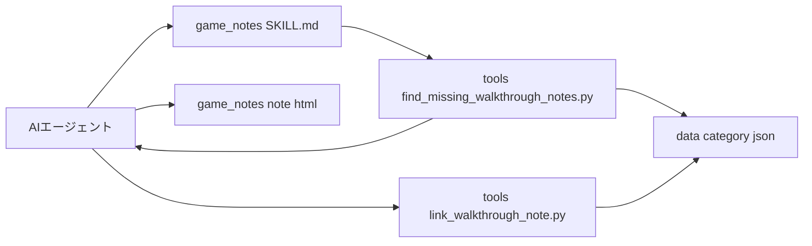

# Design Document

## Overview
**Purpose**: プレイ状況が「未プレイ」以外になったが攻略メモがまだ無いレコードを漏れなく洗い出し、既存29件のHTML実例と同じ構成・体裁の攻略メモを生成・配置・紐付けできるようにする。
**Users**: ゲームコレクション管理者(ユーザー本人)からタスクを託されたAIエージェント(Claude Codeに限らず、プロバイダ非依存)が、オフラインのセッション内でこの手順に従って攻略メモを作成する。
**Impact**: 新たに`tools/`配下に2本のPython CLIスクリプトと、`game_notes/SKILL.md`という手順書を追加する。既存の`hardware_detail.html`・`scripts/data-store.js`・`netlify/functions/*`・データスキーマには一切変更を加えない(`play-status-tracking`で確立済みの`walkthrough_note_path`表示ロジックをそのまま利用する)。

### Goals
- プレイ状況が「未プレイ」以外かつ`walkthrough_note_path`未設定のレコードを決定論的に列挙できる
- 既存29件のHTML実例と同じ構成・改行表示・カラーコード既定値で新規攻略メモを生成する手順を文書化する
- 生成した攻略メモを`game_notes/{category}/{hardware}/{title}.html`に配置し、対応レコードの`walkthrough_note_path`を安全に更新する
- 手順をプロバイダ非依存の文書として再利用可能にする

### Non-Goals
- ライブサイト上でのリアルタイムAI API呼び出し(brief.mdで明示的に対象外)
- 生成される攻略内容の正確性の保証
- 既存29件のMarkdown→HTML変換(実施済み)
- `play_status`フィールドや`walkthrough_note_path`表示ロジック自体の変更(`play-status-tracking`の責務であり、本specは変更しない)

## Boundary Commitments

### This Spec Owns
- 対象レコード(プレイ状況が未プレイ以外かつ`walkthrough_note_path`未設定)を列挙するスクリプト(`tools/find_missing_walkthrough_notes.py`)
- 生成した攻略メモHTMLのファイルパスを対応レコードの`walkthrough_note_path`に安全に書き込むスクリプト(`tools/link_walkthrough_note.py`)
- 攻略メモHTMLの構成・文体・既定カラーコード・改行表示規則を定義する手順書(`game_notes/SKILL.md`)

### Out of Boundary
- ライブサイトでのAI API呼び出し・関連するNetlify Function追加
- 生成された攻略メモの内容の正確性保証(調査結果の裏取りは行わない)
- `play_status`フィールドの追加・UI・保存動作(`play-status-tracking`が既に実装済み)
- `walkthrough_note_path`が設定されたレコードの表示・リンク描画ロジック(`hardware_detail.html`側は`play-status-tracking`で実装済みのものをそのまま使う)
- 既存29件のMarkdown→HTML変換処理(完了済み)

### Allowed Dependencies
- `data/*.json`(12カテゴリファイル)の既存スキーマ(`soft_title`, `play_status`, `walkthrough_note_path`)を読み取り・更新対象とする(スキーマ自体は`play-status-tracking`が定義したものを変更せず利用する)
- `game_notes/`配下の既存29件のHTMLファイルを構成テンプレートの参照元として読み取る
- 実行環境にPython 3(標準ライブラリのみ、追加パッケージ不要)が利用可能であることを前提とする

### Revalidation Triggers
- `data/*.json`のフィールド名(`walkthrough_note_path`, `play_status`, `soft_title`)や値の意味が変更された場合、両スクリプトとSKILL.mdの記述を再確認する
- `game_notes/{category}/{hardware}/{title}.html`という配置規則自体が変更された場合、SKILL.mdと`link_walkthrough_note.py`のパス生成規則を再確認する
- 既存29件のHTML構成(見出し・目次・折りたたみセクション・CSS)に変更が入った場合、SKILL.mdのテンプレート規則を再同期する

## Architecture

### Existing Architecture Analysis
- `play-status-tracking`が確立した契約: レコードの`walkthrough_note_path`が設定されていれば`hardware_detail.html`がそのゲーム行に攻略情報リンクを表示し、未設定ならリンクを表示しない。本specはこの契約の「書き手」側(ファイルの生成・配置・`walkthrough_note_path`への書き込み)のみを担当し、「読み手」側(表示ロジック)には触れない。
- `game_notes/`配下には既に29件の実例が存在し、いずれも同じ構成(タイトル見出し→目次→折りたたみセクション)を持つ。2026-07-23の修正で、改行表現を`white-space: pre-line`方式から明示的`<br>`方式へ刷新し(タグ間の改行文字1つだけでも余分な空行として表示されてしまう欠陥のため)、見出しレベル別の区切り改行数(見出し大=3・見出し中=2・見出し小以下=1)というルールを確立した(詳細は`research.md`のDesign Decisions参照)。この規則をSKILL.mdに明文化しなければ、将来の生成で同じ不具合が再発する。

### Architecture Pattern & Boundary Map
本specは新しいサービスやランタイムを追加しない。AIエージェントがオフラインセッション内で手動実行する2本のCLIスクリプトと、1つの手順書からなる。



**Architecture Integration**:
- 選択パターン: 手順書 + 2本の独立したバッチ型CLIスクリプト(サービス化・常駐化しない)
- 責務分離: 「対象抽出」と「配置後の紐付け」を別スクリプトに分離し、それぞれが単一責任を持つ(抽出スクリプトはデータを変更しない読み取り専用、紐付けスクリプトは1レコードずつ明示的な引数で更新する)
- 既存パターン踏襲: `data/*.json`のUTF-8・2-space indent・非ASCIIエスケープ無しというフォーマットを、本セッション中に実証済みのPython `json`モジュール(`ensure_ascii=False, indent=2`)の使い方で踏襲する
- 新規コンポーネントの理由: 巨大JSON(最大93,000行超)への手動編集はデータ損失のリスクが高く(本セッション中に実際に発生した前例がある)、決定論的なスクリプトによる読み書きが必要

### Technology Stack

| Layer | Choice / Version | Role in Feature | Notes |
|-------|------------------|-----------------|-------|
| Tooling / CLI | Python 3(標準ライブラリのみ、`json`モジュール) | 対象抽出・`walkthrough_note_path`の安全な書き込み | 新規の外部依存を追加しない。実行環境にPython 3が必要 |
| Documentation | Markdown(`game_notes/SKILL.md`) | 生成手順・HTML構成規則の定義 | プロバイダ非依存。特定AI製品のAPIを前提としない |
| Data | 既存`data/*.json`(12ファイル) | 読み取り対象・更新対象 | スキーマは`play-status-tracking`が確定済み。変更しない |

## File Structure Plan

### Directory Structure
```
tools/
├── find_missing_walkthrough_notes.py   # 対象レコード列挙(読み取り専用)
└── link_walkthrough_note.py            # walkthrough_note_pathの安全な書き込み

game_notes/
└── SKILL.md                             # 生成手順・HTML構成規則の定義(新規)
```

### Modified Files
なし。既存の`hardware_detail.html`・`scripts/data-store.js`・`netlify/functions/*`・`data/*.json`のスキーマ・`game_notes/`配下の既存29件のファイルは変更しない(スクリプト実行時に個別のレコードの`walkthrough_note_path`フィールドが追記されるのみ)。

## System Flows

```mermaid
sequenceDiagram
    participant Agent as AIエージェント
    participant Find as find_missing_walkthrough_notes.py
    participant Data as data/*.json
    participant Note as game_notes/.../*.html
    participant Link as link_walkthrough_note.py

    Agent->>Find: 実行
    Find->>Data: 全カテゴリを読み取り
    Find-->>Agent: 対象レコード一覧(JSON Lines)
    loop 対象レコードごと
        Agent->>Agent: ハード名・タイトルで調査し攻略メモ本文を作成
        Agent->>Note: HTMLファイルを作成(SKILL.mdの構成規則に従う)
        Agent->>Link: 実行(file, hardware, title, path)
        Link->>Data: 該当レコードのwalkthrough_note_pathを更新
        Link-->>Agent: 完了 または 既に設定済みのためスキップ
    end
```

- 既に`walkthrough_note_path`が設定されているレコードは`find_missing_walkthrough_notes.py`の出力に現れないため、AIエージェントが二重生成することはない(要件1.2, 3.3)
- `link_walkthrough_note.py`は書き込み前に対象レコードの`walkthrough_note_path`が既に設定されていないかを確認し、設定済みならエラーではなくスキップとして完了する(冪等性)

## Requirements Traceability

| Requirement | Summary | Components | Interfaces | Flows |
|-------------|---------|------------|------------|-------|
| 1.1, 1.2, 1.3 | 未プレイ以外かつ未紐付けレコードの列挙 | find_missing_walkthrough_notes.py | Batch Contract | System Flow: 実行→一覧出力 |
| 1.4 | 対象レコードの識別情報出力 | find_missing_walkthrough_notes.py | Batch Contract(出力スキーマ) | - |
| 2.1, 2.2, 2.3, 2.4 | 攻略メモHTMLの構成・改行表示・既定カラーコード・文体模倣 | game_notes/SKILL.md | ドキュメント内テンプレート規則 | System Flow: HTMLファイル作成 |
| 2.5, 4.4 | プロバイダ非依存の手順文書化 | game_notes/SKILL.md | ドキュメント全体の前提記述 | - |
| 3.1 | 配置先ディレクトリ規則 | game_notes/SKILL.md | パス生成規則の記述 | System Flow: HTMLファイル作成 |
| 3.2 | walkthrough_note_pathの更新 | link_walkthrough_note.py | Batch Contract | System Flow: Link実行 |
| 3.3 | 既存設定済みレコードへの再生成防止 | link_walkthrough_note.py, find_missing_walkthrough_notes.py | Batch Contract(冪等性チェック) | System Flow: スキップ分岐 |
| 3.4 | 完了後の対象一覧からの除外 | find_missing_walkthrough_notes.py | Batch Contract | System Flow全体のループ終了条件 |
| 4.1, 4.2, 4.3 | 手順書の内容(構成規則・抽出手段の使い方・配置紐付け手順) | game_notes/SKILL.md | ドキュメント構成 | - |

## Components and Interfaces

| Component | Domain/Layer | Intent | Req Coverage | Key Dependencies (P0/P1) | Contracts |
|-----------|--------------|--------|---------------|--------------------------|-----------|
| find_missing_walkthrough_notes.py | Tooling | 対象レコードを列挙する | 1.1, 1.2, 1.3, 1.4 | data/*.json (P0) | Batch |
| link_walkthrough_note.py | Tooling | 1レコードのwalkthrough_note_pathを安全に更新する | 3.2, 3.3 | data/*.json (P0) | Batch |
| game_notes/SKILL.md | Documentation | 生成手順・テンプレート規則を定義する | 2.1-2.5, 3.1, 3.4, 4.1-4.4 | game_notes/内の既存29件(P1、テンプレート参照) | - |

### Tooling

#### find_missing_walkthrough_notes.py

| Field | Detail |
|-------|--------|
| Intent | プレイ状況が未プレイ以外かつ`walkthrough_note_path`未設定のレコードを、全カテゴリJSONファイルから列挙する |
| Requirements | 1.1, 1.2, 1.3, 1.4 |

**Responsibilities & Constraints**
- `data/`配下の全カテゴリJSONファイルを読み取り専用で走査する(書き込みを行わない)
- `play_status`が存在しない、または`"not_started"`のレコードは対象から除外する(`play-status-tracking`の既定値ルールと整合)
- `walkthrough_note_path`が既に空文字列以外の値を持つレコードは対象から除外する
- `soft_title`キーが欠落した不正なレコードに遭遇してもクラッシュせず、警告を出しつつスキップする(本セッション中に実データで遭遇した問題への対処)

**Dependencies**
- Inbound: AIエージェント(SKILL.mdの手順から呼び出す)(P0)
- Outbound: `data/*.json`(読み取りのみ)(P0)

**Contracts**: Service [ ] / API [ ] / Event [ ] / Batch [x] / State [ ]

##### Batch / Job Contract
- Trigger: AIエージェントが手動で`python tools/find_missing_walkthrough_notes.py`を実行する
- Input / validation: コマンドライン引数なし。実行ディレクトリはリポジトリルート(`data/`が相対パスで解決できること)を前提とする
- Output / destination: 標準出力へ、対象レコード1件につき1行のJSON(JSON Lines形式)。各行は`{"file": "data/8_sie.json", "hardware": "PlayStation4", "soft_title": "..."}`の形式を持つ
- Idempotency & recovery: 読み取り専用のため何度実行しても副作用はない。異常終了時も既存データへの影響はない

**Implementation Notes**
- Integration: `link_walkthrough_note.py`が同じレコードを更新した後に本スクリプトを再実行すると、そのレコードは出力から自然に消える(要件3.4)
- Validation: 既知の対象件数(手動で数えたサンプル)と出力件数が一致することを実装時に確認する
- Risks: `data/8_sie.json`が93,000行超と大きいため、実行に数秒かかる可能性がある(オフライン・手動実行のため許容範囲内)

#### link_walkthrough_note.py

| Field | Detail |
|-------|--------|
| Intent | 生成済みの攻略メモHTMLのパスを、対応する1レコードの`walkthrough_note_path`に安全に書き込む |
| Requirements | 3.2, 3.3 |

**Responsibilities & Constraints**
- 対象ファイル・ハード名・ゲームタイトル(完全一致)・書き込むパスの4つを明示的な引数として受け取る
- 該当レコードに既に`walkthrough_note_path`が設定されている場合は上書きせずスキップし、その旨を出力する(冪等性、要件3.3)
- 該当レコードが0件または2件以上見つかった場合は、何も書き込まずにエラーを報告する(ハード名+タイトルの組は本来一意である前提の安全確認)
- 書き込みは既存ファイルのフォーマット(UTF-8, 非ASCIIエスケープ無し, インデント2スペース, 元ファイルの改行コード(CRLF/LF)と末尾改行の有無)を一切変えずに保ったまま行う。実データは`data/*.json`12ファイル中10ファイルがCRLF・末尾改行無し、2ファイル(`data/1_nintendo.json`, `data/8_sie.json`)がLF・末尾改行有りという混在状態であるため、書き込み前に元ファイルの生バイトから改行コード・末尾改行の有無を判定し、そのまま復元すること(タスク2.1実装時に判明・対処済み)

**Dependencies**
- Inbound: AIエージェント(SKILL.mdの手順から、攻略メモHTML作成後に呼び出す)(P0)
- Outbound: `data/*.json`(対象1ファイルの読み取り・上書き)(P0)

**Contracts**: Service [ ] / API [ ] / Event [ ] / Batch [x] / State [ ]

##### Batch / Job Contract
- Trigger: AIエージェントが手動で`python tools/link_walkthrough_note.py --file <path> --hardware <name> --title <soft_title> --path <note_path>`を実行する
- Input / validation: 4つの必須引数。`--file`は`data/`配下の対象JSONファイル、`--title`は`soft_title`と完全一致する文字列
- Output / destination: 対象JSONファイルをその場で上書き。標準出力に成功/スキップ/エラーのいずれかを1行で報告する
- Idempotency & recovery: 既に設定済みのレコードへの再実行はスキップとして正常終了する(エラーにしない)。書き込み前に対象ファイル全体をメモリ上でロードしてから丸ごと書き直すため、途中失敗時も元のファイルは意図せず部分的に破損しない

**Implementation Notes**
- Integration: `find_missing_walkthrough_notes.py`が出力する`file`/`hardware`/`soft_title`の値をそのまま本スクリプトの引数として使える形式に揃える
- Validation: 実装時に、既存29件のいずれか1件を対象に「既に設定済み」パスでスキップされることを確認する
- Risks: タイトルに`☑`等の記号が含まれる場合、`soft_title`の完全一致(記号込み)が必要である点をSKILL.md側でも明記する

### Documentation

#### game_notes/SKILL.md

| Field | Detail |
|-------|--------|
| Intent | 攻略メモHTMLの生成手順・構成規則・既定カラーコード・改行表示規則を定義し、対象抽出・紐付けスクリプトの使い方を説明する |
| Requirements | 2.1, 2.2, 2.3, 2.4, 2.5, 3.1, 3.4, 4.1, 4.2, 4.3, 4.4 |

**Responsibilities & Constraints**
- `game_notes/`配下の既存29件を具体例として参照し、以下を明文化する:
  - `<!DOCTYPE html>`から`<body>`までの完全なHTML構成(タイトル見出し・目次・折りたたみ式セクション)
  - 改行は明示的な`<br>`タグでのみ表現し、`<style>`に`white-space: pre-line;`を含めないこと(2026-07-23に刷新済みの方式。含めると改行文字が余分な空行として表示される不具合が再発する)
  - 見出しレベルに応じた区切り改行数(見出し大=`<br>`×3、見出し中=`<br>`×2、見出し小以下=`<br>`×1)をセクション末尾・`</details>`の直前に置くこと
  - `<h1>`に色指定がある場合はタイトル全体を`<span style="color:#XXXXXX">...</span>`で囲むこと(注記部分だけを着色しないこと)。色指定が無い場合は既定で黒(`#000000`)とすること
  - 既存メモの文体(個人の感想を含むトーン)をできる範囲で模倣すること
- `tools/find_missing_walkthrough_notes.py`の実行方法と出力の読み方を説明する
- `tools/link_walkthrough_note.py`の実行方法(4引数)と、既に紐付け済みのレコードはスキップされる(生成処理をしない)ことを説明する
- 特定のAIプロバイダのAPIやツールに依存する記述を含めない(Claude Code固有のツール名を手順の必須要素として書かない)

**Dependencies**
- Inbound: AIエージェント(手順書として読む)(P0)
- Outbound: なし(ドキュメントのため実行時依存はない)

**Contracts**: Service [ ] / API [ ] / Event [ ] / Batch [ ] / State [ ]

**Implementation Notes**
- Integration: 本ドキュメントは`game_notes/`配下の既存29件を「生きた実例」として参照するため、既存ファイルの構成が変わった場合はドキュメントも追随して更新する必要がある(Revalidation Trigger参照)
- Validation: 実装時に、ドキュメントの指示のみを読んだ想定で1件試験生成し、既存29件と構造的に一致するか(見出し・目次・折りたたみ・CSS・空行なし)を確認する
- Risks: 生成AIの調査能力や情報源はエージェントごとに異なるため、文体模倣や内容の充実度に差が出る可能性がある(brief.mdで正確性・品質は保証しない旨を明示済み)

## Data Models
本specは既存の`data/*.json`スキーマ(`soft_title`, `play_status`, `walkthrough_note_path`)を変更しない。`link_walkthrough_note.py`は既存レコードの`walkthrough_note_path`フィールドに値を1つ書き込むのみであり、新しいフィールド・エンティティ・関係は導入しない。

## Error Handling

### Error Strategy
両スクリプトはCLIとして明確な終了コードとメッセージで失敗を報告する。ファイル全体を書き換える前に対象レコードの特定・妥当性確認を完了させ、部分的な書き込みによるファイル破損を避ける。

### Error Categories and Responses
- **入力誤り**(該当レコードが0件または2件以上見つかる、`--file`が存在しない等) → 何も書き込まず、AIエージェントに分かる具体的なメッセージ(該当ファイル・ハード名・タイトル)を出力して終了する
- **データ品質問題**(既存レコードに`soft_title`が欠落している等) → 該当レコードのみをスキップし、走査自体は継続する(本セッション中に実データで遭遇した問題への対処)
- **冪等性による正常スキップ**(`walkthrough_note_path`が既に設定済み) → エラーではなく成功扱いのスキップとして報告する(要件3.3)

## Testing Strategy

- **Unit Tests**:
  - `find_missing_walkthrough_notes.py`: `play_status`が`not_started`・未設定・`playing`・`cleared`の4パターンで対象抽出の有無が要件1.2, 1.3どおりになることを確認する
  - `find_missing_walkthrough_notes.py`: `soft_title`が欠落したレコードを含む入力でクラッシュせずスキップされることを確認する
  - `link_walkthrough_note.py`: 対象レコードが0件・1件・2件以上の場合それぞれの挙動(エラー/成功/エラー)を確認する
  - `link_walkthrough_note.py`: `walkthrough_note_path`が既に設定済みのレコードに対してスキップ(上書きしない)されることを確認する(要件3.3)
- **Integration Tests**:
  - 実データのコピー上で「抽出→(手動でHTML作成)→紐付け→再抽出」の一連の流れを実行し、紐付け後のレコードが再抽出結果から消えることを確認する(要件3.4)
  - `link_walkthrough_note.py`実行後のJSONファイルが既存フォーマット(UTF-8, 非ASCIIエスケープ無し, インデント2スペース)を保っていることをdiffで確認する
- **Manual Doc Review**:
  - `game_notes/SKILL.md`の指示のみに従って1件試験生成し、既存29件と構造的に一致すること(見出し・目次・折りたたみ・`white-space: pre-line`を使わない`<br>`方式・見出しレベル別の区切り改行数・タイトル全体の色付け)を確認する
